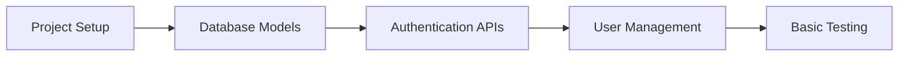
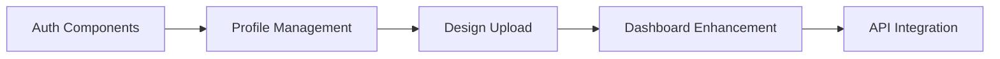
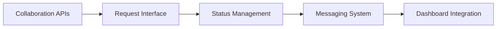
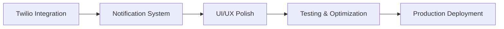

# Fashion Design Platform - Project Summary & Next Steps

## 📋 **PROJECT OVERVIEW**

I have created a comprehensive plan to transform your existing React fashion design website into a full-stack platform with backend functionality, user authentication, company profiles, collaboration features, and SMS notifications.

### **Current State Analysis**
- ✅ **Frontend**: React 19.1.0 with React Router, custom styling, and image galleries
- ✅ **Structure**: Well-organized components for dress, jewelry, and shoes categories
- ✅ **Design**: Professional black/beige theme with good UX foundation
- ❌ **Backend**: No backend functionality currently
- ❌ **Authentication**: Basic mock login system
- ❌ **Collaboration**: No collaboration features
- ❌ **Notifications**: No notification system

### **Target State Vision**
- 🎯 **Full-stack platform** with Node.js/Express backend
- 🎯 **Dual user types**: Individual designers and companies
- 🎯 **Collaboration system** with SMS notifications via Twilio
- 🎯 **Enhanced dashboards** with real-time features
- 🎯 **Design management** with upload, like, save, share functionality
- 🎯 **Professional deployment** on Vercel with MongoDB Atlas

## 📚 **DELIVERABLES CREATED**

### **1. Tech Stack Architecture** ([`tech-stack-architecture.md`](tech-stack-architecture.md))
- **Complete technology stack** selection and justification
- **Database schema design** for users, designs, collaborations, and notifications
- **Authentication system** with JWT and user type differentiation
- **API endpoint architecture** with RESTful design
- **SMS integration** with Twilio configuration
- **Deployment strategy** for Vercel hosting

### **2. Implementation Roadmap** ([`implementation-roadmap.md`](implementation-roadmap.md))
- **8-week development timeline** broken down by phases
- **Detailed task breakdown** with daily objectives
- **File structure organization** for scalable development
- **Dependency management** with specific package versions
- **Risk mitigation strategies** and success metrics
- **Testing and deployment procedures**

### **3. Component Wireframes** ([`component-wireframes.md`](component-wireframes.md))
- **11 detailed wireframes** for all major UI components
- **Authentication flow** with user type selection
- **Enhanced dashboards** for both individuals and companies
- **Collaboration interfaces** with request management
- **Mobile responsive designs** for all screen sizes
- **Interaction specifications** and accessibility guidelines

### **4. API Documentation** ([`api-documentation-template.md`](api-documentation-template.md))
- **Complete API reference** with request/response examples
- **Authentication endpoints** for registration and login
- **Design management APIs** with file upload support
- **Collaboration system APIs** with status management
- **Notification system** with real-time updates
- **Error handling** and rate limiting specifications

## 🎯 **KEY FEATURES PLANNED**

### **Authentication & User Management**
- [x] **Dual registration**: Individual designers vs. companies
- [x] **Profile management**: Enhanced profiles with portfolios
- [x] **User discovery**: Follow/unfollow system with social features
- [x] **Role-based access**: Different permissions for users and companies

### **Design Management System**
- [x] **Upload interface**: Drag-and-drop with image optimization
- [x] **Categorization**: Dress, jewelry, shoes with tagging
- [x] **Engagement features**: Like, save, share functionality
- [x] **Portfolio management**: Personal design galleries
- [x] **Search & discovery**: Advanced filtering and recommendations

### **Collaboration Platform**
- [x] **Request system**: Companies can request collaborations
- [x] **Terms negotiation**: Budget, timeline, deliverables
- [x] **Status tracking**: Pending, accepted, declined, completed
- [x] **Communication**: Built-in messaging system
- [x] **Project management**: File sharing and progress tracking

### **Notification System**
- [x] **SMS integration**: Twilio for instant notifications
- [x] **Real-time updates**: Dashboard notifications
- [x] **Email backup**: SendGrid for important updates
- [x] **Preference management**: User-controlled notification settings

### **Enhanced Dashboards**
- [x] **Individual dashboard**: Stats, activity, collaborations
- [x] **Company dashboard**: Discovery, active projects, analytics
- [x] **Analytics**: Engagement metrics and performance tracking
- [x] **Mobile optimization**: Responsive design for all devices

## 🚀 **IMPLEMENTATION PHASES**

### **Phase 1: Backend Foundation (Weeks 1-2)**


### **Phase 2: Frontend Integration (Weeks 3-4)**


### **Phase 3: Collaboration System (Weeks 5-6)**


### **Phase 4: SMS & Polish (Weeks 7-8)**


## 💰 **ESTIMATED COSTS**

### **Development Services (Monthly)**
- **MongoDB Atlas**: $0-9/month (Shared cluster → Dedicated)
- **Twilio SMS**: $0.0075 per SMS (estimate $20-50/month)
- **Cloudinary**: $0-99/month (Free → Pro based on usage)
- **Vercel Hosting**: $0-20/month (Hobby → Pro if needed)
- **SendGrid Email**: $0-15/month (Free → Essentials)

**Total Monthly Operating Cost**: $20-193/month depending on usage

### **Development Time Investment**
- **Solo Developer**: 8 weeks full-time (320 hours)
- **Small Team (2 devs)**: 4-5 weeks (160-200 hours each)
- **Part-time Development**: 12-16 weeks (20 hours/week)

## 🎨 **DESIGN SYSTEM ENHANCEMENTS**

### **Maintaining Brand Consistency**
- **Color Palette**: Keep existing black (#181818) and beige (#ede7df) theme
- **Typography**: Maintain current font hierarchy with Bebas Neue and Montserrat
- **Component Library**: Create reusable components for consistency
- **Responsive Design**: Mobile-first approach for all new features

### **New UI Components**
- **Authentication forms** with user type selection
- **Dashboard cards** with statistics and activity feeds
- **Collaboration modals** with rich form interfaces
- **Notification center** with real-time updates
- **File upload areas** with drag-and-drop functionality

## 📊 **SUCCESS METRICS & KPIs**

### **Technical Performance**
- [ ] **API Response Time**: < 200ms average
- [ ] **Image Upload Success**: > 99% success rate
- [ ] **SMS Delivery Rate**: > 95% delivered
- [ ] **Mobile Performance**: > 90 Lighthouse score
- [ ] **Uptime**: > 99.9% availability

### **User Engagement**
- [ ] **Registration Completion**: > 80% completion rate
- [ ] **Design Upload Rate**: > 95% success rate
- [ ] **Collaboration Response**: > 60% response rate within 48 hours
- [ ] **User Retention**: > 70% return within 30 days
- [ ] **Session Duration**: > 5 minutes average

### **Business Impact**
- [ ] **Monthly Active Users**: Track growth trajectory
- [ ] **Collaboration Conversion**: Measure request-to-completion rate
- [ ] **Design Engagement**: Monitor likes, saves, shares per design
- [ ] **Company Adoption**: Track company registration and activity
- [ ] **Revenue Potential**: Assess monetization opportunities

## 🔄 **IMMEDIATE NEXT STEPS**

### **Week 1 Action Items**
1. **Set up development environment**
   - [ ] Create MongoDB Atlas cluster
   - [ ] Set up Twilio account and phone number
   - [ ] Configure Cloudinary account
   - [ ] Set up Vercel project with environment variables

2. **Initialize backend structure**
   - [ ] Create `/api` folder structure
   - [ ] Install required dependencies
   - [ ] Set up database connection
   - [ ] Create initial user model

3. **Plan development workflow**
   - [ ] Set up Git branching strategy
   - [ ] Create development and staging environments
   - [ ] Set up basic CI/CD pipeline
   - [ ] Establish code review process

### **Development Environment Setup**
```bash
# Install backend dependencies
npm install express mongoose bcryptjs jsonwebtoken cors helmet joi twilio cloudinary multer

# Install frontend dependencies
npm install axios react-dropzone react-image-crop react-toastify react-hook-form date-fns

# Set up environment variables
cp .env.example .env.local
# Configure: MONGODB_URI, JWT_SECRET, TWILIO_*, CLOUDINARY_*
```

## 🤝 **COLLABORATION OPPORTUNITIES**

### **Potential Team Roles**
- **Backend Developer**: API development, database design, SMS integration
- **Frontend Developer**: React components, UI/UX implementation
- **UI/UX Designer**: Wireframe refinement, user experience optimization
- **DevOps Engineer**: Deployment automation, monitoring setup
- **QA Tester**: Testing automation, user acceptance testing

### **External Services Integration**
- **Design Tools**: Potential integration with Figma, Adobe Creative Suite
- **Payment Processing**: Future Stripe integration for monetization
- **Analytics**: Google Analytics, Mixpanel for user behavior tracking
- **Customer Support**: Intercom or Zendesk for user support

## 🎯 **LONG-TERM VISION**

### **Phase 2 Features (Months 3-6)**
- **Advanced search** with AI-powered recommendations
- **Team collaboration** for companies with multiple users
- **Design contests** and community challenges
- **Marketplace integration** for design sales
- **Mobile app** development for iOS and Android

### **Phase 3 Features (Months 6-12)**
- **AI design assistance** and trend analysis
- **Video content** support for design process documentation
- **International expansion** with multi-language support
- **Advanced analytics** dashboard for business insights
- **API marketplace** for third-party integrations

## 📞 **SUPPORT & MAINTENANCE**

### **Ongoing Requirements**
- **Security updates** and dependency management
- **Performance monitoring** and optimization
- **User feedback** collection and feature iteration
- **Content moderation** for design uploads
- **Customer support** system implementation

### **Scaling Considerations**
- **Database optimization** as user base grows
- **CDN implementation** for global image delivery
- **Caching strategies** for improved performance
- **Load balancing** for high-traffic scenarios
- **Backup and disaster recovery** procedures

---

## 🎉 **CONCLUSION**

This comprehensive plan provides everything needed to transform your fashion design website into a professional collaboration platform. The structured approach ensures:

- **Clear development path** with measurable milestones
- **Scalable architecture** that can grow with your user base
- **Professional user experience** that matches industry standards
- **Cost-effective implementation** using modern, efficient technologies
- **Future-ready foundation** for advanced features and monetization

The next step is to begin Phase 1 implementation, starting with the backend foundation and authentication system. With this detailed roadmap, you have a clear path to creating a successful fashion design collaboration platform.

**Ready to begin implementation? Let's start building your vision into reality!** 🚀